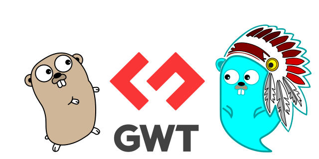
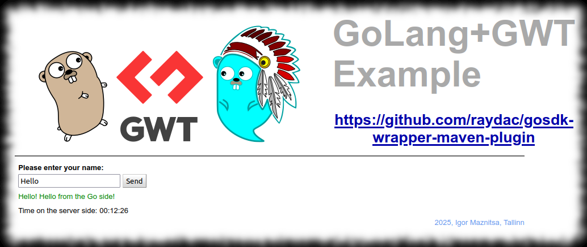

# Introduction

Golang doesn't provide any GUI out of the box, there are some 3rd party libraries for that but unfortunately not many of them work in real cross-platform manner or provide rich set of features and nice GUI. Fortunately today we have WEB as modern cross-platform UI technology which provides even more than we need.

In 2010 I took a part in a big project which strongly used [GWT](http://www.gwtproject.org/) for frontend part and I decided that it would be interesting to try to organize GUI for a golang application through [GWT](http://www.gwtproject.org/) which would be used as frontend (also it would make possibility to use powerful GWT extensions like [GWT-Ext](http://gwt-ext.com/demo/) or [Smart-GWT](https://www.smartclient.com/smartgwt/showcase)). Of course it sounds very heterogenic and usually such projects make pain (especially in Golang which doesn't provide strong possibilities for build and dependency management out of the box) but because GWT is a Java based technology then it is possible to use [Maven](https://maven.apache.org/) to build both Java part and Golang part in the same project without problems (Golang part will be built through [gosdk-wrapper-maven-plugin](https://github.com/raydac/gosdk-wrapper-maven-plugin)).   

# Project structure
The Project contains two parts
 * __frontend__ part written in GWT, all stuff related to the front end part is situated in the `frontend` folder
 * __backend__ part written in Golang, al stuff related to the backend part is situated in the `backend` folder
 
It is not just regular web service because:
 * it starts on 127.0.0.1 local address
 * it doesn't have fixed port number, just after start it looks for free port and open default web browser by providing formed page URL
 * it will be closed in 5 seconds after GUI part in browser is closed by user

## Frontend part

The Part doesn't have any magic and implemented as a single web age aplication which shows text field and button. If enter some text into the text field and then press the send button then the entered text will be sent to the Golang part and the returned result will be shown just under the text field. Also the timer label situated just under the text feld shows the current time gotten from the Goang part. The Compiled part takes a bit more space tha it could be ecause I ave trned off GWT obfuscation to provide better diagnostic information. All communication with the backend part is based on GET and POST requests, there is not any web-socket use.

## Backend part

It is a just simple Golang application implementing web server. Just after start it finds first free port and use it to start inside web server on local address 127.0.0.1, after that it opens the link to the inside main web page in default system browser. If it doesn't get requests from its frontend part during 5 seconds then it guesses that its frontend part has been closed and end execution.   
As third party libraries I use below listed ones:
 * __[open-golang](https://github.com/skratchdot/open-golang)__ to open default system browser for provded URL
 * __[go-bindata](https://github.com/jteeuwen/go-bindata)__ to pack frontend static data into executable file

# Requirements for build

It requires pre-installed __[Java SDK 11+](http://www.oracle.com/technetwork/java/javase/downloads/index.html)__ and [Maven 3.8.1+](https://maven.apache.org/) on your machine. Because the project uses [gosdk-wrapper-maven-plugin](https://github.com/raydac/gosdk-wrapper-maven-plugin) it will automatically download GoLang SDK.  
__NB! Java is needed only for build purposes! As the build result there will be just standard Golang executable file which can be delivered  and started without any Java!__

# How to build
You can just clone the project through `git clone https://github.com/raydac/go-gwt-example.git` and then execute `mvn` command inside cloned folder (the project has default goals `clean install`)

# Where to look for executable file?
After build you can open `backend/bin` folder and there will be `backend-1.0.0-SNAPSHOT` or `backend-1.0.0-SNAPSHOT.exe` executable file which is the result file. If to execute such file then __default system browser__ will be started and frontend part will be shown.  

